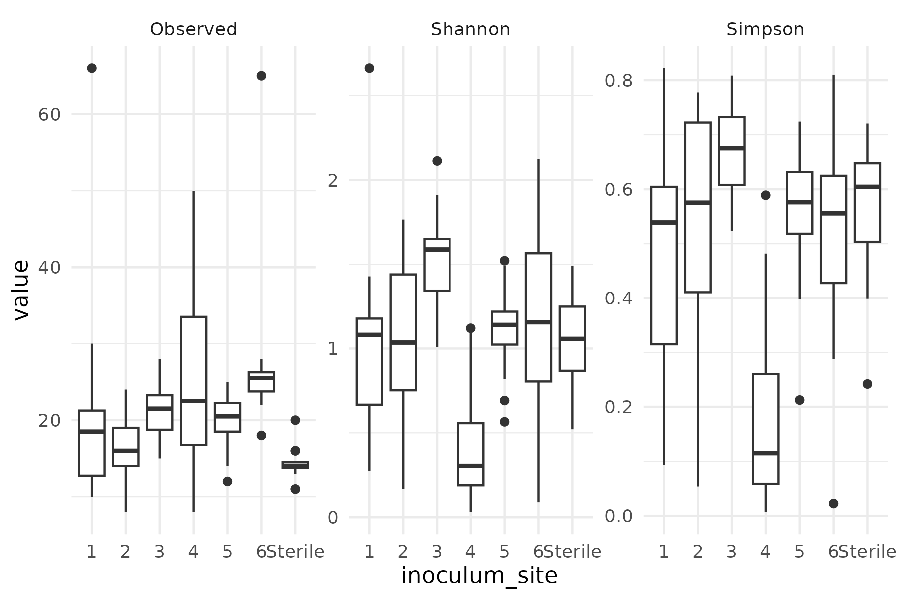

```{r setup, include=FALSE}
knitr::opts_chunk$set(echo = FALSE,warning = FALSE,message = FALSE)
library(tidyverse)
library(knitr)
library(patchwork)
library(kableExtra)
setwd("../R/")
```


**Preliminary data analyses, *focused only on Grand Fir at this time***


# Takeaways:

Putting the conclusions up top for convenience...

**BACTERIA**

  - Inoculum source had a fairly strong influence on bacterial communities, explaining 30% of community distance
  - Bacterial taxa *Rhizobium*, *Phenylobacterium*, and *Neorhizobium* are strongly associated with increased "plant health." They seem to be in the right abundances in **inoculum site 4**.
  - Need Beta-dispersion tests to see whether inoculum bacteria or fungi vary more by source
  

**FUNGI**

  - Inoculum source explains about 26% of fungal community distance
  - Found a number of fungi linked to increased "plant health"
  - But fungi associated with plant metrics were not as linked to their inoculum source as bacteria were
  - **Need Beta-dispersion tests to see whether inoculum bacteria or fungi vary more by source**
  

<br>

___

<br>

# **Alpha-diversity exploration**

Here's a quick glance at alpha diversity for both bacterial and fungal ASVs, grouped by inoculum source:

## Bacteria
```{r}

```

**ANOVA and Tukey Test indicated no significant difference in any of the alpha diversity metrics for bacteria.**

## Fungi
```{r}

```

**ANOVA and Tukey Test indicate that samples inoculated from "Inoculum Site 4" had several significant differences in fungal alpha diversity.** Here are the pairings that were significantly different (along with the direction of the difference).

```{r}

```

<br>

___

<br>

# **Aim 1:** 

Determine the ecological, phylogenetic, and network properties of root microbiomes that promote seedling performance

*How do we define the concept of 'promotes seedling performance?'*

  - Leaf number
  - Leaf length
  - Wilting scale
  - Bud number
  - Shoot/root dry mass
  - Plant height

___

## **Hypotheses**

  - **H1:** Guild abundance hypothesis: Seedling performance will be enhanced when root microbiomes have a greater proportion of microbial mutualists (e.g., ectomycorrhizal fungi) relative to saprotrophs, endophytes, or pathogens
  - **H2:** Microbial trait hypothesis: Seedling performance will be enhanced in root microbiomes that are enriched in taxa that confer tolerance to stress (e.g., Dove et al. 2022)
  - **H3:** Functional diversity: Seedling performance will be enhanced in root microbiomes comprised of taxa that represent high functional diversity
  - **H4:** Network connectivity: Seedling performance will be enhanced when root microbiomes contain taxa with high co-occurrence network connectivity

<br>

___

<br>

## **Ecological properties**

### Bacteria (16S | V6-V8)

  - Trait analysis (BacDive Database analysis slowly ongoing)
  

### Fungi (ITS2)

How does the proportion of mutualist fungi relate to indicators of plant health?

In the following figure, the X-axis represents the proportion of fungi that could be identified to a mutualistic guild; the Y-axis represents the value of the various measures of plant success (facets). Y-axis scales vary between facets.

```{r, fig.width=8,fig.height=5}
p5 <- readRDS("../Output/ITS_Mutualist_Plot.RDS")
p5
```

```{r}
mod2 <- readRDS("../Output/ITS_Mutualist_Model.RDS")
mod2 %>% 
  broom::tidy() %>% 
  mutate(term=term %>% str_remove("indicator"),
         across(where(is.numeric),function(x){round(x,3)})) %>% 
  kable() %>% 
  kable_classic(lightable_options = 'hover')

```

The proportion of mutualist fungal guild(s) in a given sample was a significant indicator of increased plant health, regardless of the health indicator measured.


___

Functional potential is quite a bit trickier. The FungalTraits database is pretty sparse. You will see lots of missing data (represented as 0 for our purposes). Here, I've taken the number of known functionally important enzymatic pathways that have been noted in a given taxa, and scaled them by the observed relative abundance of that taxon in a given sample.

```{r, fig.width=8,fig.height=5}
p6 <- readRDS("../Output/ITS_Functional_Plot.RDS")
p6
```

As you can see from all the x-axis 0's, most taxa in this system had no real functional annotations available. This is probably swamping out any chance we have of detecting a signal.

```{r}
mod3 <- readRDS("../Output/ITS_Functional_Model.RDS")
mod3 %>% 
  broom::tidy() %>% 
  mutate(term=term %>% str_remove("indicator"),
         across(where(is.numeric),function(x){round(x,3)})) %>% 
  kable() %>% 
  kable_classic(lightable_options = 'hover')

```

Nothing worth noting here... :(

<br>
_____

<br>


## **Phylogenetic properties**

### Bacteria (16S | V6-V8)

  - Phylogenetic dispersion
  - 

### Fungi (ITS2)

  - Phylogenetic dispersion is tricky with ITS markers :(
  - 
  

<br>
_____

<br>


## **Network properties**

### Bacteria (16S | V6-V8)

  - Network analysis
  - Co-ocurrence 

### Fungi (ITS2)

  - Network analysis
  - Co-ocurrence 
  
  
<br>
_____

<br>


# **Aim 2:**

**Determine how microbial transplants impact root microbiome community development and seedling performance in post-wildfire soils** (Questions in red not addressed here...yet)


  - **Inocula source:** How does source of inocula impact root microbiome community development and seedling performance in post-wildfire soil?
  - <span style="color: red;">**Priority effects:** How do priority effects impact the development of the root microbiome and conifer seedling performance in post-wildfire soils?</span>
  - **Resident soil biota:** How does the resident soil microbial community modulate the impact of the donor microbial community on the root and rhizosphere microbiome and on plant performance?
  - <span style="color: red;">**Environmental conditions:** How do soil properties (e.g., nutrient availability, moisture, pH, texture) modulate the impacts of the soil microbiome on plant performance in post wildfire soils?</span>


## Inoculum impact on microbial community


### Bacteria (16S | V6-V8)

Inoculum source 'burn frequency' is nested within inoculum 'site.' 

```{r}
readRDS("../Output/16S_inoculum_nestedness.RDS") %>% kable() %>% kable_classic(lightable_options = 'hover') %>% kableExtra::add_footnote("rows are burn freq., cols are sites, indicating sample counts in each combination")
  
```


But here are NMDS ordinations of bacterial community, colored by inoculum properties:


```{r fig.align='center'}
p1 <- readRDS("../Output/16S_Ordination_by_inoculum_source.RDS") + labs(color="Inoculum\nsite")
p2 <- readRDS("../Output/16S_Ordination_by_inoculum_burnfreq.RDS")

p1 + p2

```

PermANOVA with formula Community ~ inoculum site * inoculum burnfreq:

```{r}
readRDS("../Output/16S_PermANOVA_inoculum_source.RDS") %>% 
  mutate(term = term %>% str_remove("ps\\@sam_data\\$")) %>% 
  kable() %>% kable_classic(lightable_options = 'hover') %>% 
  add_footnote("Inoculum source explains ~ 30% of bacterial community structure")
```

___

A Heatmap of bacterial ASVs with at least 10% total relative abundance (across all samples), split by inoculum source:

```{r}
readRDS("../Output/16S_heatmap_mostabund.RDS")
```

<br>
_____

<br>


### Fungi (ITS2)


```{r fig.align='center'}
p1 <- readRDS("../Output/ITS_Ordination_by_inoculum_source.RDS") + labs(color="Inoculum\nsite")
p2 <- readRDS("../Output/ITS_Ordination_by_inoculum_burnfreq.RDS")

p1 + p2

```

PermANOVA with formula Community ~ inoculum site * inoculum burnfreq:

```{r}
readRDS("../Output/ITS_PermANOVA_inoculum_source.RDS") %>% 
  mutate(term = term %>% str_remove("ps\\@sam_data\\$")) %>% 
  kable() %>% kable_classic(lightable_options = 'hover') %>% 
  add_footnote("Inoculum source explains ~ 26% of fungal community structure")
```

___

A Heatmap of Fungal ASVs with at least 10% total relative abundance (across all samples), split by inoculum source:

```{r}
readRDS("../Output/ITS_heatmap_mostabund.RDS")
```


<br>
_____

<br>

## **Inoculum impact on seedling performance**


### Bacteria (16S | V6-V8)

How were various plant traits affected by inoculum source?

(model outputs below - These are the same for fungi, since the predictor was simply inoculum source, not the actual community)

```{r}
df <- readRDS("../Output/alpha_df.RDS")
df %>% 
  pivot_longer(c(shoot_dm,final_root_dm,height,leaf_number),
               names_to = "phenotype", values_to = "value") %>% 
  ggplot(aes(x=inoculum_site,y=value)) +
  geom_boxplot(fill="green") +
  facet_wrap(~phenotype,scales = 'free') +
  theme_minimal() + theme(strip.text = element_text(face='bold',size=12)) +
  labs(x="Inoculum site",y="Observed phenotype value")
  

```


**Effect of inoculum source on leaf number:**

```{r}
mod <- readRDS("../Output/16S_inoc_leafnumber_mod.RDS")
broom::tidy(mod) %>% 
  kable() %>% kable_classic(lightable_options = 'hover')

```

**Effect of inoculum source on plant height:**

```{r}
mod <- readRDS("../Output/16S_inoc_height_mod.RDS")
broom::tidy(mod) %>% 
  kable() %>% kable_classic(lightable_options = 'hover')

```

**Effect of inoculum source on shoot mass:**

```{r}
mod <- readRDS("../Output/16S_inoc_shootdm_mod.RDS")
broom::tidy(mod) %>% 
  kable() %>% kable_classic(lightable_options = 'hover')

```

**Effect of inoculum source on root mass:**

```{r}
mod <- readRDS("../Output/16S_inoc_rootdm_mod.RDS")
broom::tidy(mod) %>% 
  kable() %>% kable_classic(lightable_options = 'hover')

```

**Is there something special about inoculum site 4?**

Plants that received inoculum from site 4 had significantly stronger indicators of 'plant health.'

Site 3 (which presumably had the same burn frequency as site 4), had significantly worse plant outcomes.

A random forest model, using bacterial community found that increased relative abundance of the following taxa were significantly predictive of site 4:


```{r}

```

This effect of "Site 4" was most pronounced on **Leaf Number.** Looking directly at that, a similar random forest model can be used to see what taxa specifically are associated with increased leaf number, regardless of inoculum source.

```{r}

```

**Again, we see *Rhizobium* taxa, but also note that *Phenylobacterium* turns up as an important player.**

<br>
_____

<br>

A differential abundance analysis at the genus level shows other bacterial taxa which have significant deviations from the "Sterile Inoculum" samples.

```{r fig.width=12}
x <- readRDS("../Output/16S_diffabund_inocsite.RDS")
# x$data$taxa <- # tidy taxa names
#   paste(x$data$taxa %>% str_remove_all("_incertae_sedis") %>% str_split("_") %>% map_chr(4),
#        x$data$taxa %>% str_remove_all("_incertae_sedis") %>% str_split("_") %>% map_chr(5),
#        x$data$taxa %>% str_remove_all("_incertae_sedis") %>% str_split("_") %>% map_chr(6),
#       sep=" ")
x$data$variable <- x$data$variable %>% 
  str_remove("\nDifferential Abundance") %>%
  str_replace("inoculum_site","site ")
x
```

___

We can look closer at significant taxa of interest such as *Rhizobium* and *Phenylobacterium* which turned up as important in the random forest models:

```{r}
p1 <- readRDS("../Output/16S_bbdml_plot_1.RDS") + theme(legend.position = 'none')
p2 <- readRDS("../Output/16S_bbdml_plot_2.RDS") + theme(legend.position = 'bottom') + labs(color="Inoculum source")
p1 / p2
```

<br>

___

<br>


### Fungi (ITS2)


```{r}

```

This effect of "Site 4" was most pronounced on **Leaf Number.** Looking directly at that, a similar random forest model can be used to see what taxa specifically are associated with increased leaf number, regardless of inoculum source.

```{r}

```


<br>
_____

<br>

A differential abundance analysis at the genus level shows other fungal taxa which have significant deviations from the "Sterile Inoculum" samples.

```{r fig.width=12}
x <- readRDS("../Output/ITS_diffabund_inocsite.RDS")
# x$data$taxa <- # tidy taxa names
#   paste(x$data$taxa %>% str_remove_all("_incertae_sedis") %>% str_split("_") %>% map_chr(4),
#        x$data$taxa %>% str_remove_all("_incertae_sedis") %>% str_split("_") %>% map_chr(5),
#        x$data$taxa %>% str_remove_all("_incertae_sedis") %>% str_split("_") %>% map_chr(6),
#       sep=" ")
x$data$variable <- x$data$variable %>% 
  str_remove("\nDifferential Abundance") %>%
  str_replace("inoculum_site","site ")
x
```


<br>

___

<br>

## **Soil properties influence on microbiome and plant performance**

**Overview of soil properties for each inoculum source:**


```{r, fig.width=12,fig.height=10}
df <- read_csv("../Data/SoilChem.csv") %>% 
  dplyr::select("Field","NO3","NH4","P","K","SO4-S","B","OM","pH","EC","Zn","Mn","Cu","Fe","Ca","Mg","Na", "TKN","C:N") %>% 
    mutate(inoc_site=Field %>% str_split("-") %>% map_chr(2) %>% str_split("\\.") %>% map_chr(1) %>% 
             str_remove("W") %>% str_replace("Mixed","Sterile") %>% str_replace("Unmixed","Sterile")) %>% 
  dplyr::select(-Field) %>% 
  mutate(across(-inoc_site,SpiecEasi::clr)) %>% 
  pivot_longer(-inoc_site) 

p <-
  df %>% 
  ggplot(aes(x=inoc_site,y=value)) +
  geom_boxplot() +
  facet_wrap(~name,scales = 'free') +
  theme_minimal() +
  theme(axis.text.x = element_text(angle=90,hjust=1),
        strip.text = element_text(face='bold',size=10),
        strip.background = element_rect(fill="#8aab8f",color = 'black',linewidth = .5))
p + labs(caption = "All values are center log-ratio transformed for comparisons")
```


Testing for significant differences between the samples...

Here are the soil properties that differ significantly between inoculum sources. Sterile inoculum soils are set as the intercept. The stats below pretty nicely reflect the obvious patterns in the overall figure.
```{r}
mod <- df %>% 
  mutate(inoc_site=factor(inoc_site,levels=c("Sterile","1","2","3","4","5","6"))) %>% 
  glm(data=.,formula=value~name+ name:inoc_site) 

mod %>% 
  broom::tidy() %>% 
  mutate(term=term %>% str_remove("name")) %>% 
  dplyr::filter(p.value<0.05) %>% 
  mutate(across(where(is.numeric),function(x){round(x,3)})) %>% 
  kableExtra::kable() %>% 
  kableExtra::kable_classic(lightable_options = 'hover') %>% 
  kableExtra::scroll_box(height = '400px',width = '800px')
```


